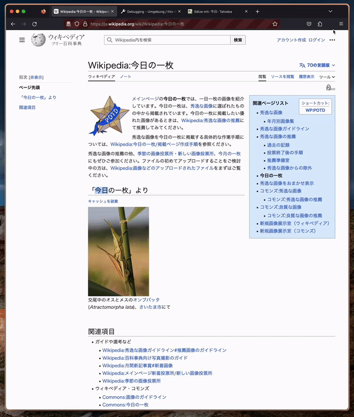

# Tatoeba Lookup

<!--  -->
 
 
Install for [Firefox
](https://addons.mozilla.org/en-US/firefox/addon/tatoeba-lookup/) | [Chrome](https://chrome.google.com/webstore/detail/tatoeba-lookup/jkhhkdnkpplccgpkhokipcjbjkdimahc)

Tatoeba Lookup is a WebExtension that allows users to fetch and display definitions for selected words from the Tatoeba dictionary.

## Features

- Lookup example sentences for the selected word on any webpage.

## Usage

1. Select (highlight) the word you want to look up on any webpage.
2. Click the Tatoeba Lookup extension icon in your toolbar.
3. The popup will display example sentences containing the selected word.

## Installing from source
Clone the repo, run `npm run build` and do the following, depending on your browser

* [**Firefox**](https://developer.mozilla.org/en-US/docs/Mozilla/Add-ons/WebExtensions/Your_first_WebExtension#installing)
* [**Chrome**](https://developer.chrome.com/docs/extensions/mv3/external_extensions/)

## Acknowledgements

- [Tatoeba](https://tatoeba.org/eng)
- [Tatoeba Logo](https://commons.wikimedia.org/wiki/File:Tatoeba_Logo.svg)
- [Esperanto flag](https://commons.wikimedia.org/wiki/File:Twemoji-style_Esperanto_flag.svg)
- [Toki Pona flag](https://commons.wikimedia.org/wiki/File:Twemoji-style_Toki_Pona_flag.svg)
